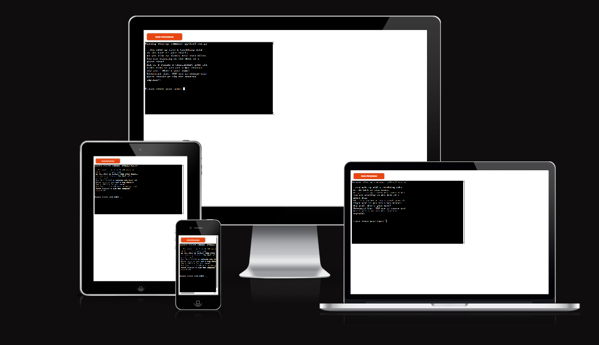
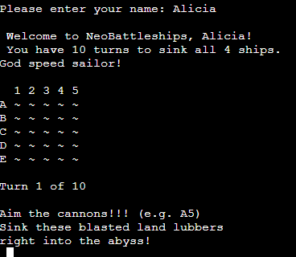
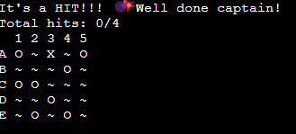
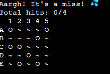
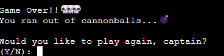

# Neo-Battleships
The neo-battleships is a fun game of battleships with a bit of a pirate flare. 
It is a terminal game which runs on the Code institute mock terminal on Heroku. 

* Here is how my game looks from computer, pad or phone.

## How to play

The game is based on the classic board game of "Sink the ship" or "Battleships".
In my version the player is thrown into some roleplay where they are asked to enter their name,
followed by a fun game against the computer where the player has to try to sink all the hidden ships (4)
and do so with 10 bombs. 
The board is 5*5 and the ships are randomly generated each time. 

Empty slots are marked with a ~
Hits are marked with an X 
And misses are marked with an O.

The player wins if they manage to find and sink all four battleships and looses if they run out of turns.
At the end of each game, the player is asked if they want to play again, if they choose yes the game starts over.
And if they choose no, the game is ended and the player is bid farewell.

## Features 

* Generate a random board
* Play a pirate roleplay game against the computer
* Accepts users input
* Maintain a count and hit score
* Input validation and error checking
** Which means the user cannot place a ship same place twice
** They have to enter a letter/number input for where they would like to make a guess

## Future features

* Computer board is also displayed and the computer makes random guesses
* Highscore count for the player names
* Choose board size and placing ships yourself
* Have larger ships

## Testing

* I have passed the code through PEP8 linter and confirmed there are no problems
* Made sure there is an error message that prints if the user makes invalid inputs
* Tested in my local terminal as well as the Code Institute Heroku terminal

## Solved bugs

* I have built almost my entire game in the PythonCode Pad which has built in bug testing 
so it has quickly shown me when I have made something wrong. It also has a "play" function,
so I have continuously been able to play my code through to see if it worked and if it didn't the
app would point out to me what line of code was causing the trouble.
* Spotted and fixed problem with while loop with the help of ChatGPT.
* Got error messages about whitespace and long lines on PEP8 and got help from ChatGPT to reformat it with black to clean it up.

## Remaining bugs

* Only bug remaining is that it only seems to work on some mobile phones, while working perfectly on both computer and ipad.

## Validator tesing 

* PEP8, got error messages about whitespace but fixed it with reformatting with AI.

## Deployment

* Created a new heroku app
* Set the buildpacks to Python and NodeJS in that order
* Link the Heroku app to the respository
* Click deploy

* Finished game can be found on https://neo-battleship-fe0233bd52d8.herokuapp.com/

## Credits

* Code institute for the deployment terminal
* My mentor Luke Buchanan - For much help and support in this proccess

* For fundamental build stategy - https://www.youtube.com/watch?v=tF1WRCrd_HQ&ab_channel=KnowledgeMavens
* For building a row of letters and columns of numbers board https://stackoverflow.com/questions/53446425/creating-a-row-of-numbers-letters-in-my-python-battleship-game
* For inspiration and how to fix my inputs with isdigit() - https://discuss.codecademy.com/t/how-can-i-be-sure-i-tested-my-battleship-project-properly/339283/11
* For image on responsivenes over different devices - https://ui.dev/amiresponsive
* For additional help when encountering problems or lines of code I did not understand how or why, ELI5 command in ChatGPT
